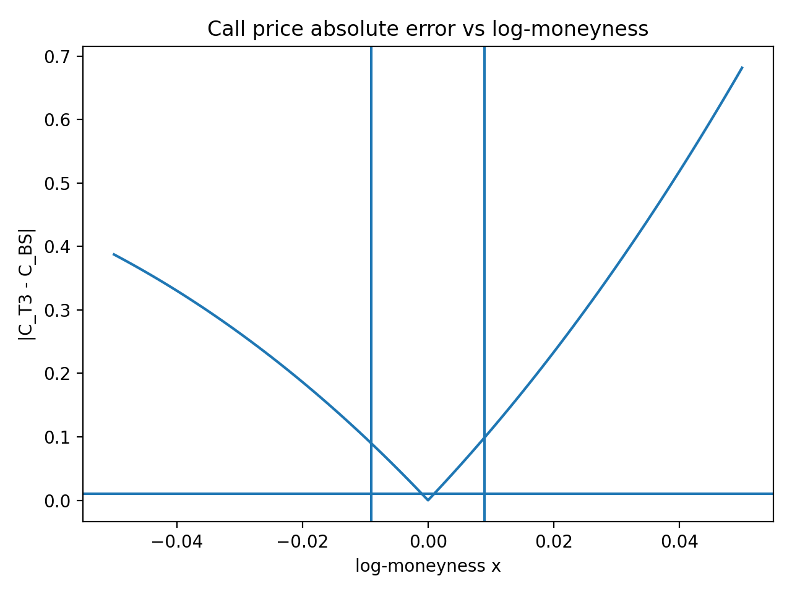
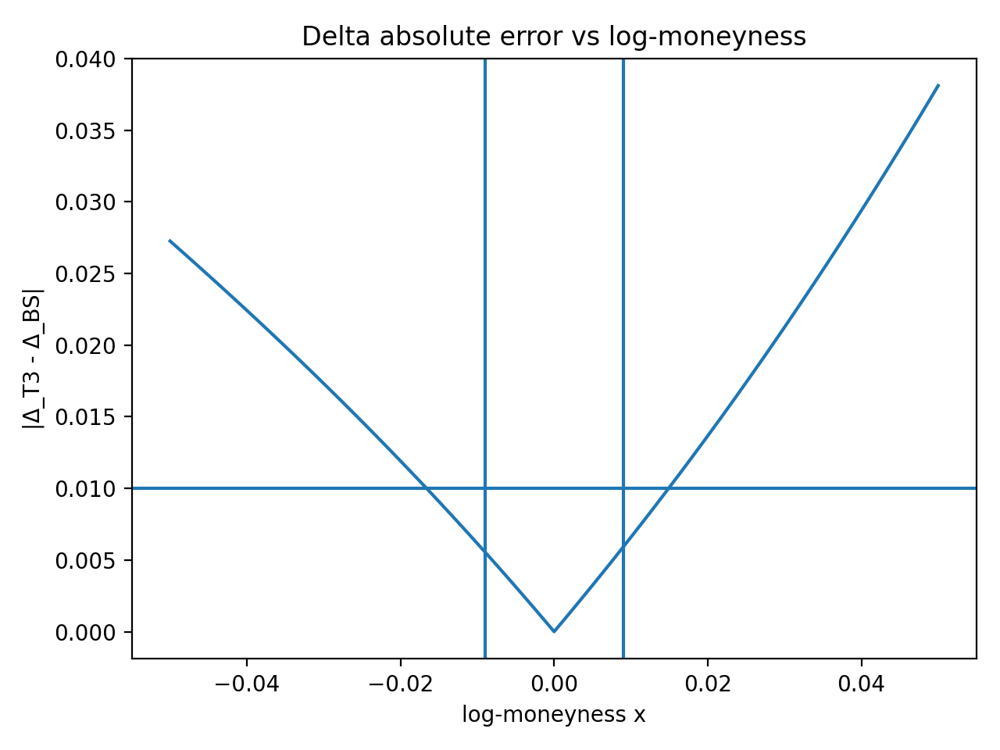
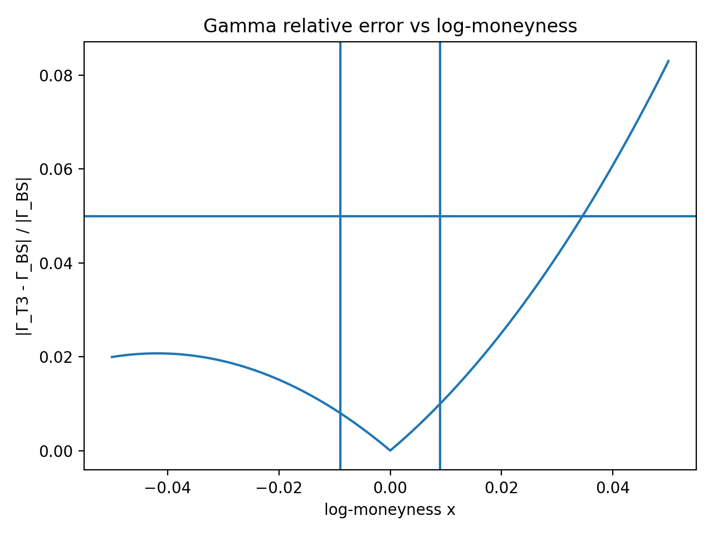
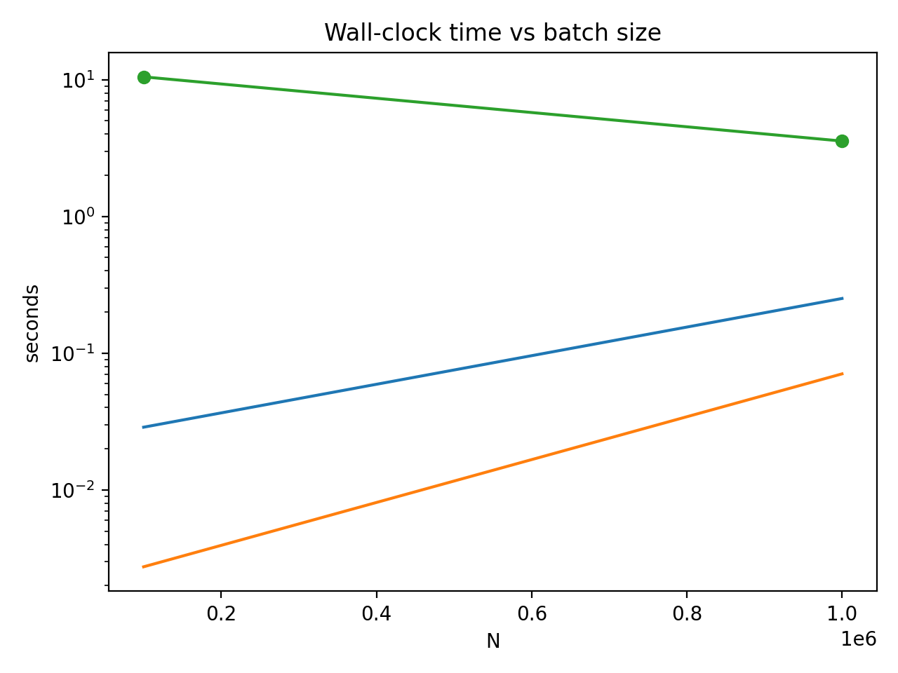
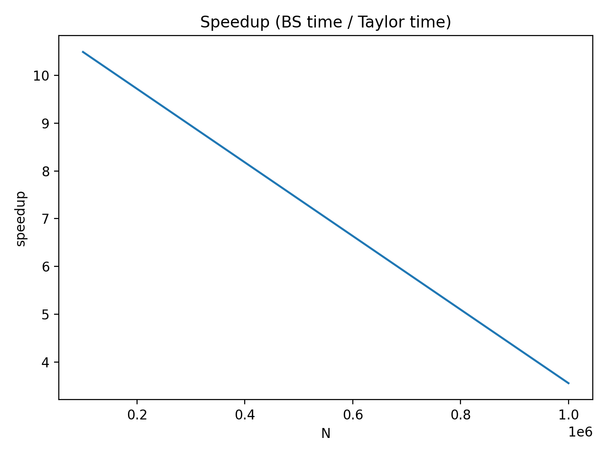

# BSM-Taylor
Taylor-series approximation of the **Black–Scholes–Merton (BSM)** European option price, with experiments that measure **pricing/Greeks error (Price, Δ, Γ)** and **runtime speedup** versus the exact closed-form BSM pricer.

This repo is built around one question: **how local is a Taylor approximation of BSM, and how quickly does it degrade as you move away from the expansion point?**

---

## Contents

### Core implementation
- `BSM.py` — baseline BSM price / Greeks used as the reference (“ground truth”)
- `Taylor.py` — Taylor approximation implementation around an expansion point

### Experiments
- `sweep.py` — runs parameter sweeps (spot/moneyness and other settings)
- `error.py` — computes error metrics (price / delta / gamma)
- `speed.py` — measures timing and speedup (exact BSM vs Taylor)
- `plot.py` — plotting utilities
- `make_outputs.py` — convenience script to regenerate artifacts in `outputs/`

---

## Outputs (plots + data)

This project keeps precomputed artifacts in `outputs/`:

- `outputs/baseline_sweep.csv`
- `outputs/error_price.png`
- `outputs/error_delta.png`
- `outputs/error_gamma_rel.png`
- `outputs/speed_times.png`
- `outputs/speed_speedup.png`

> `outputs/summary.txt` is a run log and should **not** be tracked.

### Preview

#### Price error


#### Delta error


#### Gamma error (relative)


#### Timing


#### Speedup


---

## Math (high level)

BSM European call price:

$$
C(S,K,r,\sigma,T) = S\,N(d_1) - K e^{-rT} N(d_2)
$$

$$
d_1 = \frac{\ln(S/K) + \left(r + \tfrac{1}{2}\sigma^2\right)T}{\sigma\sqrt{T}},
\quad
d_2 = d_1 - \sigma\sqrt{T}
$$

Taylor approximation idea (illustrative; order \(N\) around an expansion point \(S_0\)):

$$
C(S) \approx \sum_{n=0}^{N}\frac{C^{(n)}(S_0)}{n!}(S-S_0)^n
$$

The focus here is empirical: **map the error** as parameters move away from the expansion point and compare **runtime tradeoffs**.

---

## Setup

Install the usual scientific Python stack:

```bash
pip install numpy scipy matplotlib
